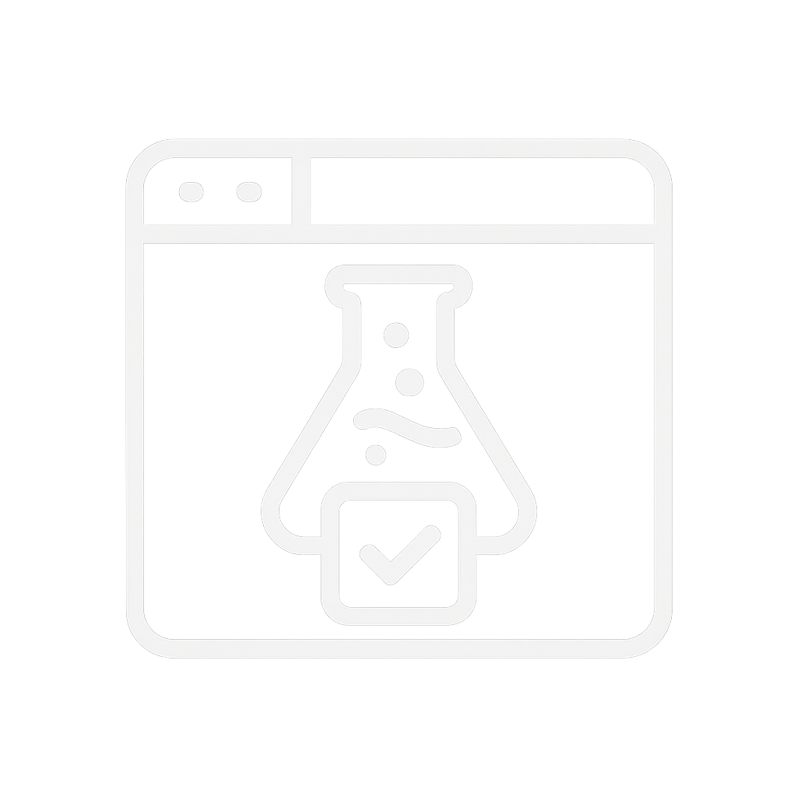

<p align="center">
  
</p>

<h1 align="center">TabLab</h1>

This extension helps you manage your tasks and personalize your boring new tab.

To use the extension, you can either download the folder or clone it using the command.

```ps1
https://github.com/Quema100/TabLab.git
```

> [!TIP]   
> Once you have downloaded the folder, go to **`chrome://extensions/`** in your Chrome browser.  
> enable the developer mode, and then load the extension by selecting the downloaded folder.

## Feedback

Your feedback is always welcome!  

If you encounter any bugs or issues, please create an issue. 

> [!NOTE]  
> If you have any questions, please feel free to contact me.

> [!IMPORTANT]
> Upcoming updates will enable users to seamlessly toggle between dark and light modes.